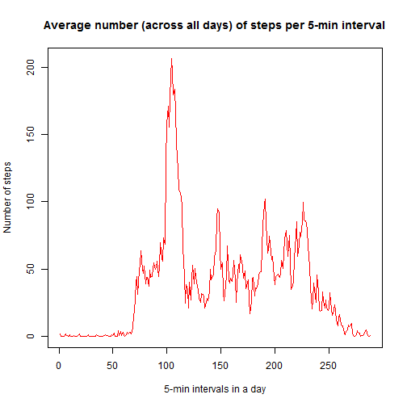

MY SCRIPT FOR PA1 REPORT
=======================================================

# A Loading and preprocessing the data

## 1 Load and inspect the data

Load the data from the csv file and look at the first and last rows and the data structure.

```r
setwd("C:/Users/Robesyn/RepData_PeerAssessment1/activity")
dir()
```

```
## [1] "activity.csv"
```

```r
act <- read.csv("activity.csv")
head(act)
```

```
##   steps       date interval
## 1    NA 2012-10-01        0
## 2    NA 2012-10-01        5
## 3    NA 2012-10-01       10
## 4    NA 2012-10-01       15
## 5    NA 2012-10-01       20
## 6    NA 2012-10-01       25
```

```r
tail(act)
```

```
##       steps       date interval
## 17563    NA 2012-11-30     2330
## 17564    NA 2012-11-30     2335
## 17565    NA 2012-11-30     2340
## 17566    NA 2012-11-30     2345
## 17567    NA 2012-11-30     2350
## 17568    NA 2012-11-30     2355
```

```r
class(act)
```

```
## [1] "data.frame"
```

```r
str(act)
```

```
## 'data.frame':	17568 obs. of  3 variables:
##  $ steps   : int  NA NA NA NA NA NA NA NA NA NA ...
##  $ date    : Factor w/ 61 levels "2012-10-01","2012-10-02",..: 1 1 1 1 1 1 1 1 1 1 ...
##  $ interval: int  0 5 10 15 20 25 30 35 40 45 ...
```


## 2 Process/transform the data

Turn dates into date class.

```r
act$date <- as.Date(act$date)
```


Reorder the columns, to have the date first, then the interval within the date, and then the number of steps for the corresponding date-time interval.

```r
act <- act[, c(2, 3, 1)]
head(act)
```

```
##         date interval steps
## 1 2012-10-01        0    NA
## 2 2012-10-01        5    NA
## 3 2012-10-01       10    NA
## 4 2012-10-01       15    NA
## 5 2012-10-01       20    NA
## 6 2012-10-01       25    NA
```


Create a wide dataset for the analysis per 5-min interval.

```r
install.packages("reshape2")
```

```
## Installing package into 'C:/Users/Robesyn/Documents/R/win-library/3.0'
## (as 'lib' is unspecified)
```

```
## Error: trying to use CRAN without setting a mirror
```

```r
library("reshape2", lib.loc = "C:/Users/Robesyn/Documents/R/win-library/3.0")
```

```
## Warning: package 'reshape2' was built under R version 3.0.3
```


```r
actwide <- dcast(act, act$date ~ act$interval, value.var = "steps")
str(actwide)
```

"Actwide" is a dataframe of 61 rows (days of activity measurement) and 288 other columns (the consecutive 5-min intervals in one day).

# B What is mean total number of steps taken per day?

## 1 Make histogram of total number of steps per day

1. First, we create a new variable, called "stepsbyday", to store the total number of steps per day. 

```r
stepsbyday <- tapply(act$steps, act$date, sum)
head(cbind(stepsbyday))
```

```
##            stepsbyday
## 2012-10-01         NA
## 2012-10-02        126
## 2012-10-03      11352
## 2012-10-04      12116
## 2012-10-05      13294
## 2012-10-06      15420
```


2. Then, we make the histogram of this new variable.  

```r
max <- max(stepsbyday[is.na(stepsbyday) == "FALSE"])
max
```

```
## [1] 21194
```

```r

hist(stepsbyday, col = "red", main = "Histogram of steps per day", ylab = "Frequency", 
    xlab = "Number of steps per day", breaks = 20, xlim = c(0, max + 3000))
```

 


## 2 Calculate mean and median total number of steps per day


```r
meanbyday <- mean(stepsbyday, na.rm = T)
meanbyday <- as.integer(meanbyday)
medianbyday <- median(stepsbyday, na.rm = T)
```


The mean total number per day is 10766 and the median total number per day is 10765. They are only 1 step per day different from each other, indicating hardly any skew in the data.

# C What is the average daily activity pattern?

First plot the raw data per day.  Each dot is the number of steps in a 5 minutes interval on a specific day. 


```r
plot(act$date, act$steps, pch = 19, cex = 1e-04, col = "blue")
```

 


## 1 Make time series plot with average number of steps per 5-min interval, averaged across all days


```r
meanperinterval <- sapply(actwide[, -1], mean, na.rm = T)
plot.ts(meanperinterval, type = "l", main = "Average number (across all days) of steps per 5-min interval", 
    ylab = "Number of steps", xlab = "5-min intervals in a day", col = "red")
```

 


## 2 Which 5-min interval, averaged across all days, contains most steps?


10927 steps in 5 min - to divide by 61 days? =179 steps per 5 min


```r
stepsperinterval <- as.data.frame(stepsperinterval)
```

```
## Error: object 'stepsperinterval' not found
```

```r
stepsperinterval/61
```

```
## Error: object 'stepsperinterval' not found
```


```r
str(stepsperinterval/61)
```

```
## Error: object 'stepsperinterval' not found
```

There are 288 5-min intervals in a day

Look for interval with 179.13 steps
Answer: interval 835! (cumulative nr of 5-min intervals) 

# D Imputing missing values

## 1 Calculate total number of rows with NAs


```r
rows <- nrow(act)
narows <- sum(is.na(act))
```

From the 17568 in the dataset, 2304 contain one or more missing values.

## 2 Devise strategy for filling missing values (e.g. mean for day, mean for 5-min interval, ...)
Replace the NA values by mean per day, from section B.

## 3 Create new dataset with missing data filled in.

## 4 Make histogram with total nr of steps per day. Calculate mean and median total steps per day. Do they differ from part B (without imputing missing values). What is impact of imputing missing data on the estimates?


# E Are there differences in activity patterns between weekdays and weekends?

## 1 Create factor 'part of week' (weekday or weekend)

## 2 Make panel plot of time series with average number of steps per 5-min interval, averaged across all weekdays OR weekenddays.


```r
install.packages("zoo")
```

```
## Installing package into 'C:/Users/Robesyn/Documents/R/win-library/3.0'
## (as 'lib' is unspecified)
```

```
## Error: trying to use CRAN without setting a mirror
```

```r
library("zoo", lib.loc = "C:/Users/Robesyn/Documents/R/win-library/3.0")
```

```
## Warning: package 'zoo' was built under R version 3.0.3
```

```
## 
## Attaching package: 'zoo'
## 
## The following objects are masked from 'package:base':
## 
##     as.Date, as.Date.numeric
```

```r

datets <- zoo(act, act$date)
```

```
## Warning: some methods for "zoo" objects do not work if the index entries
## in 'order.by' are not unique
```

```r
str(datets)
```

```
## 'zoo' series from 2012-10-01 to 2012-11-30
##   Data: chr [1:17568, 1:3] "2012-10-01" "2012-10-01" "2012-10-01" ...
##  - attr(*, "dimnames")=List of 2
##   ..$ : NULL
##   ..$ : chr [1:3] "date" "interval" "steps"
##   Index:  Date[1:17568], format: "2012-10-01" "2012-10-01" "2012-10-01" "2012-10-01" ...
```

```r
head(datets)
```

```
## Warning: some methods for "zoo" objects do not work if the index entries
## in 'order.by' are not unique
```

```
##            date       interval steps
## 2012-10-01 2012-10-01    0     <NA> 
## 2012-10-01 2012-10-01    5     <NA> 
## 2012-10-01 2012-10-01   10     <NA> 
## 2012-10-01 2012-10-01   15     <NA> 
## 2012-10-01 2012-10-01   20     <NA> 
## 2012-10-01 2012-10-01   25     <NA>
```

